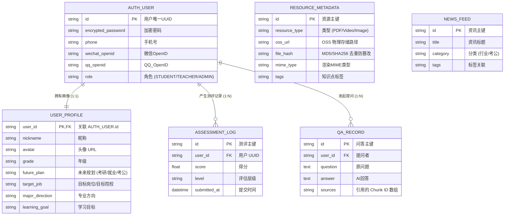

# 数据库实体与图谱模型可视化视图

本文档使用 Mermaid 将《电荔》项目复杂的混合存储架构（MySQL 扁平表 + Neo4j 知识图谱）进行了直观的图形化映射。

## 1. 关系型数据库 (MySQL) 实体关系图 (ER Diagram)

MySQL 主要负责存储用户认证、基础业务流水、资源元数据等扁平结构数据。



---

## 2. 图数据库 (Neo4j) 图谱结构视图 (Graph Schema)

Neo4j 负责存储五级分层领域知识、个人 BKT 权重，以及用于 GraphRAG 的文档切片关联。这部分不使用传统的表格，而是使用节点和有向边来表示。

```mermaid
graph TD
    %% 实体节点定义
    Domain((领域 Domain\n如: 智能电网))
    Job((岗位 Job\n如: 巡检工程师))
    KP((知识点 Knowledge Point))
    Scene((应用场景 Scene\n如: 变压器漏油抢修))
    Step((操作步骤 Step))
    
    User((个人画像 User\n脱敏 UUID))
    Chunk((文档切片 Chunk\n[含 Vector Index]))
    
    %% 样式
    classDef global fill:#4CAF50,stroke:#388E3C,stroke-width:2px,color:white;
    classDef personal fill:#2196F3,stroke:#1976D2,stroke-width:2px,color:white;
    classDef doc fill:#FF9800,stroke:#F57C00,stroke-width:2px,color:white;
    
    class Domain,Job,KP,Scene,Step global;
    class User personal;
    class Chunk doc;

    %% 全局知识骨架 (行业图谱)
    Domain -- "HAS_JOB (包含岗位)" --> Job
    Job -- "REQUIRES (要求掌握)" --> KP
    KP -- "DEPENDS_ON (前置依赖)" --> KP
    KP -- "COMPOSED_OF (包含场景)" --> Scene
    Scene -- "HAS_STEP (具体操作)" --> Step
    Step -- "SOLVES (解决故障)" --> Scene

    %% 个人动态关联 (数字孪生 BKT)
    User -- "MASTERS (掌握度)\n[Edge Props:\n mastery_score: 0.85\n prior_weight: 0.2\n interact_count: 5\n last_interact: 2026-06]" --> KP
    User -- "IN_PROGRESS (正在学习)" --> Scene

    %% RAG 文档切片关联
    KP -- "SUPPORTED_BY (文档支撑)" --> Chunk
    Scene -- "SUPPORTED_BY (案例参考)" --> Chunk
    
    %% 注释模块
    subgraph 行业通用五级图谱 (全局只读)
        Domain
        Job
        KP
        Scene
        Step
    end
    
    subgraph 个人动态网络 (高频计算更新)
        User
    end
    
    subgraph RAG联合检索区 (含 向量索引)
        Chunk
    end
```

### 📈 Neo4j 图谱模型关键特性说明：
1. **多重边复用**：`知识点 (KP)` 与 `知识点 (KP)` 之间存在循环的 `DEPENDS_ON` 依赖关系。这就是为什么前端能渲染出复杂的“技能地铁图”，以及推理智能体能计算“最近发展区 (ZPD)”的最短路径依据。
2. **复杂的 Edge Properties (边属性)**：`MASTERS` 这条边并非简单的关联，它本身就是一个**数据库表**，里面存储了 BKT（贝叶斯知识追踪）模型所需的所有实时衰减参数（得分、最后交互时间）。
3. **混合检索接入点**：`Chunk` 节点存储在图谱边缘，它的 `chunk_text` 字段会被建立原生 **Vector Index**。GraphRAG 时，先用向量相似度命中它，然后通过 `SUPPORTED_BY` 边，瞬间反查出对应的 `知识点` 和 `场景`。
