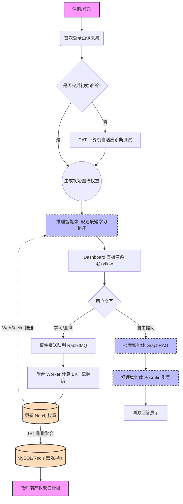
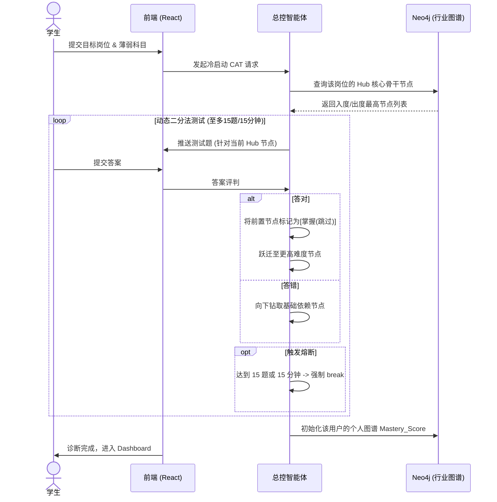
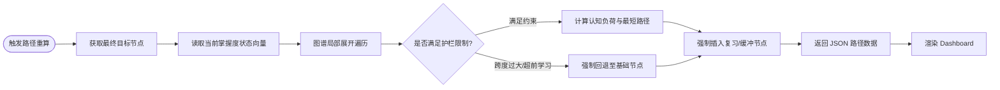
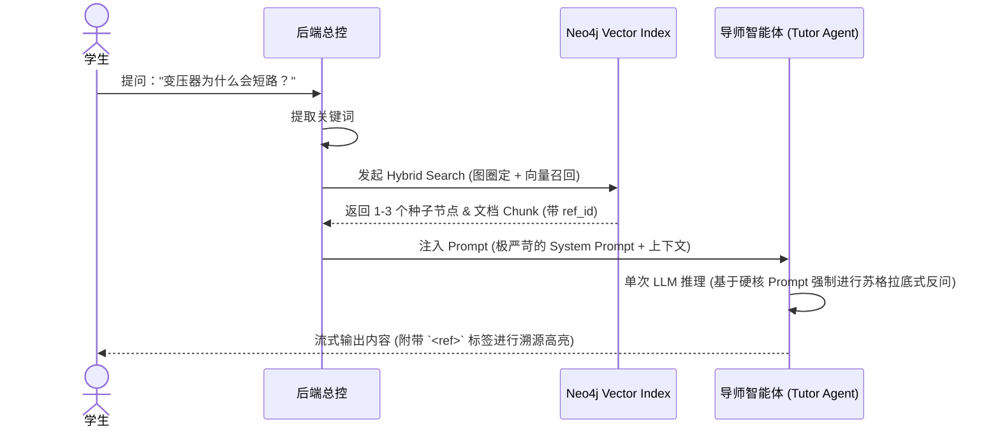

# 电荔 (Elipow) 系统全链路逻辑视图

本文档通过 Mermaid 流程图与序列图，将系统中所有核心功能的逻辑链条进行了可视化梳理，帮助您在编码前建立全局的流转思维。

## 1. 核心链路概览图 (Macroscopic Flow)

这是贯穿整个应用生命周期的主干流转逻辑：从新用户冷启动，到学习演化，再到最终的教研数据反哺。



---

## 2. 局部关键逻辑拆解

### 2.1 冷启动：CAT 诊断测试链条 (Cold Start Diagnostic)

解决如何快速摸清学生底子，而又不引发用户疲劳的问题。



### 2.2 多智能体学习路径生成 (Path Generation)

这是系统实现个性化、千人千面的核心环节。



### 2.3 渐进式苏格拉底 GraphRAG 链条 (Q&A Flow)

这是防范 AI 直接剧透、解决大模型幻觉的最硬核流程。



### 2.4 教研端双轨数据流演化 (Data Analytics Flow)

如何平衡图数据库性能与前端微观互动的实时性要求。

```mermaid
graph TD
    A[前端学习行为流水] --> B(消息队列 MQ)
    
    subgraph 微观实时流 (Event-Driven)
        B --> C{是否随堂互动场景?}
        C -- 是 --> D[Redis Pub/Sub]
        D --> E[Redis Hash 计数器 +1]
        E --> F[教师端毫秒级局部热力图刷新]
    end
    
    subgraph 宏观全局流 (T+1)
        B --> G[后台 Worker 异步消费]
        G --> H[(更新 Neo4j 个人图谱 Mastery_Score)]
        
        I((凌晨 Cron 定时跑批)) --> H
        H -. 读取并聚类 .-> J[全专业能力分布聚合计算]
        J --> K[(扁平化存入 MySQL/Redis)]
        K --> L[教师端产教缺口沙盘展示]
    end
```
